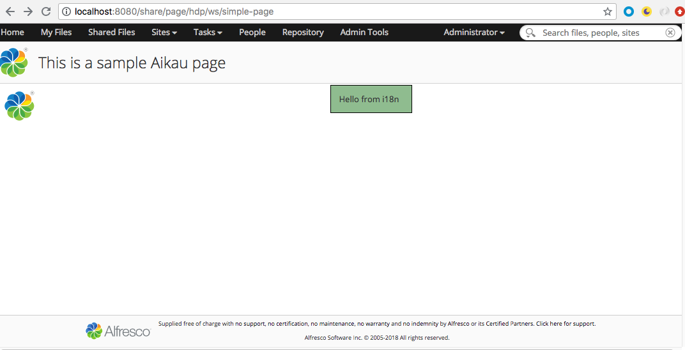
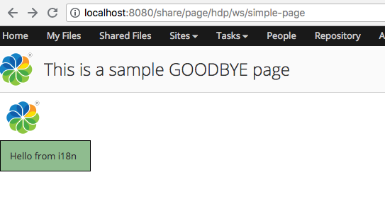
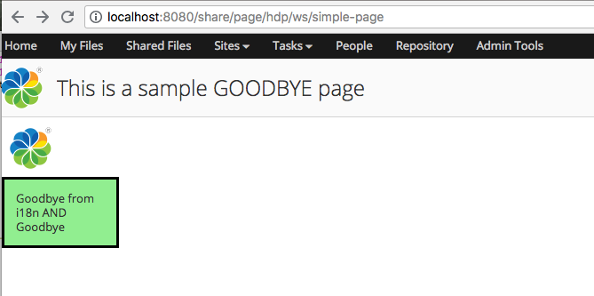

# Hot reloading of Share Extension code
Hot reloading is the ability to modify your application's code, and view the changes without 
having to restart Alfresco Tomcat (i.e. without restarting the Share Container). 
This allows for significant savings in development time that would otherwise be wasted 
restarting Tomcat. 

Hot reloading is the key to enabling Rapid Application Development (RAD) and 
Test Driven Development (TDD).

For hot reloading of classes and web resources products such as [JRebel](https://zeroturnaround.com/software/jrebel/) 
and [HotSwap](http://www.hotswapagent.org/) can be used. JRebel is a commercial product 
while HotSwap is open source. Both products can reload classes and web resources. 
However, JRebel is more powerful than HotSwap and can for example also reload changes to 
the Spring XML context files.

**We cover the usage of HotSwap in this article.** 

## Generating the Share Extension Project
Walk through the following tutorial to generate a Share extension project
and while doing it make sure to answer `Yes` to the question **Enable HotSwap Agent and DCEVM for Share Extension**:

[Gerate a Share Extension Project](generating-share-extension-project.md):

```bash
? Parent Project name? My Share Project with Hotswap
? Parent Project description?  Alfresco project for working with multiple extensions in a containerized environment
? Maven projects groupId? org.alfresco
? Maven parent project artifactId? my-share-proj-hotswap
? Maven projects version? 1.0.0-SNAPSHOT
? Package for Java classes? org.alfresco
? Would you like to use Community or Enterprise Edition for Repository and Share? Community
? Include project for Alfresco Repository Extension? No
? Include project for Alfresco Repository Aggregator and Repository Docker Build? No
? Include project for Alfresco Share Extension? Yes
? Share Extension maven artifactId? share-extension
? Share Extension Name? Share Extension
? Share Extension Description? Share extension module JAR (to be included in the share.war)
? Package Share extension as JAR or AMP? JAR
? Include project for Alfresco Share Aggregator and Share Docker Build? Yes
? Alfresco Share Community version? 6.0.c
? Alfresco Share Community Docker Image version? 6.0.c
? Enable HotSwap Agent and DCEVM for Share Extension? Yes
? Include project for Activiti Extension? No
? Include project for Activiti Aggregator and Activiti Docker Build? No
? Generate sample source code for all extensions? Yes
? Generate a developer runtime environment based on Docker Compose? Yes
? Enable Inbound Email Server? No
? Enable Outbound Email Server? Yes
```

This will generate the standard Share extension project but with some extra configuration to enable 
hot reloading.

## HotSwap Agent Activation and Configuration
*This configuration is set up for you when the project is generated.*

The Docker Compose file (my-share-proj-hotswap/runner/docker-compose/docker-compose.yml) 
in a Share Extension project has the following configuration:

```yaml
share:
      image: alfresco-share-custom:1.0.0-SNAPSHOT
      mem_limit: 1g
      environment:
          CATALINA_OPTS: "
          -Xms500m -Xmx500m
          -agentlib:jdwp=transport=dt_socket,server=y,suspend=n,address=5005
          -javaagent:/usr/local/tomcat/lib/hotswap-agent-1.3.0.jar=propertiesFilePath=/usr/local/tomcat/hotswap-agent/hotswap-agent-share.properties
          "
...
```

The `CATALINA_OPTS` environment variable configures Tomcat Remote Debugging to be 
available on port 5005. Java Class reloading can be achieved through the remote debugging configuration.
For other webapp resource files to be reloaded the HotSwap Java Agent is configured.
The configuration of the HotSwap agent is done via the **hotswap-agent-share.properties** file.
This file is mapped into the container via a volume definition as follows:

```yaml
share:
...
      volumes:
        - ../../share-extension/src/main/resources:/usr/local/tomcat/hotswap-agent/share-extension/src/main/resources
        - ../../share-extension/src/main/resources/hotswap-agent.properties:/usr/local/tomcat/hotswap-agent/hotswap-agent-share.properties
```

So we can see that we can update the HotSwap configuration by changing the configuration in the 
**share-extension/src/main/resources/hotswap-agent.properties** file.

It is also important to understand what files that are "watched" by the HotSwap agent, they are in the 
**share-extension/src/main/resources** directory, which is mapped into the container so HotSwap can detect
changes.

The HotSwap agent knows to look for changes in the **/usr/local/tomcat/hotswap-agent/share-extension/src/main/resources** 
directory by the following configuration in the **share-extension/src/main/resources/hotswap-agent.properties** file:

```properties
autoHotswap=true
disabledPlugins=Hibernate,Spring
extraWebappContext=/usr/local/tomcat/hotswap-agent/share-extension/src/main/resources/META-INF/resources
watchResources=/usr/local/tomcat/hotswap-agent/share-extension/src/main/resources
LOGGER.org.hotswap.agent=INFO
```
## Dynamic Code Evolution VM (DCEVM) Activation
*This configuration is set up for you when the project is generated.*

If you use the standard Java Runtime Environment (JRE) you can do hot reloading of Java class changes.
However, the changes you can do are very limited. Basically just change the code in a method.
If you wanted to add a new method, then that would not be supported. So to get better Java class 
hot reloading we use the [DCEVM](https://github.com/dcevm/dcevm), which is a patch of the JRE.

When you generate the custom Share Image the DCEVM is applied automatically for you. 
See the **share-aggregator-docker/Dockerfile** file for more info. 

## Testing the Hot Reloading Configuration
The Share Extension project comes with an Aikau Page and an Aikau Widget that we can try out hot reloading on. 
The page can be accessed with the `http://localhost:8080/share/page/hdp/ws/simple-page` URL, and it looks like this:



The pages uses only text based files, so no Java code is involved. See the [hot reloading tutorial 
for Repository Extensions](hot-reloading-repository-extensions.md) for information about how to do Java Class reloading,
it should work the same for Java code in Share.
 
Let’s start by changing the page title and layout. This is done in the 
**share-extension/src/main/resources/alfresco/web-extension/site-webscripts/com/example/pages/simple-page.get.js** file:

```json
model.jsonModel = {
    widgets: [{
        id: "SET_PAGE_TITLE",
        name: "alfresco/header/SetTitle",
        config: {
            title: "This is a sample GOODBYE page"
        }
    },
        {
            id: "MY_HORIZONTAL_WIDGET_LAYOUT",
            name: "alfresco/layout/VerticalWidgets",
            config: {
                widgetWidth: 50,
                widgets: [
                    {
                        id: "DEMO_SIMPLE_LOGO",
                        name: "alfresco/logo/Logo",
                        config: {
                            logoClasses: "alfresco-logo-only"
                        }
                    },
                    {
                        id: "DEMO_SIMPLE_MSG",
                        name: "tutorials/widgets/TemplateWidget"
                    }
                ]
            }
        }]
};
```

Now, step into the Share Extension directoryand compile the code:

```bash
share-extension mbergljung$ mvn compile alfresco:refresh-share
```

Note here that because we are making changes to the Surf Web Script controller we need to refresh the 
Web Script container so it knows about it. This is done via the Alfresco Maven plugin and 
the `alfresco:refresh-share` command. This command also clears certain dependency caches.

In the browser refresh the Aikau page to see the changes:

 

All good so far. Let’s update the style, template, and JavaScript code for the Aikau widget and see how that goes.

Starting with the Widget style code in **share-extension/src/main/resources/META-INF/resources/share-extension/js/tutorials/widgets/css/TemplateWidget.css**:

```css
.my-template-widget {
   border: 3px #000000 solid;
   padding: 1em;
   width: 100px;
   background-color: lightgreen;
}
```

Then update the property in the **share-extension/src/main/resources/META-INF/resources/share-extension/js/tutorials/widgets/i18n/TemplateWidget.properties** file:

```properties
hello-label=Goodbye from i18n
```

Then change the Widget template in the **share-extension/src/main/resources/META-INF/resources/share-extension/js/tutorials/widgets/templates/TemplateWidget.html** file:

```html
<div class="my-template-widget">${greeting} AND ${greeting2}</div>
```

And finally the controller for the widget. Edit this **share-extension/src/main/resources/META-INF/resources/share-extension/js/tutorials/widgets/TemplateWidget.js** file:

```javascript
define(["dojo/_base/declare",
        "dijit/_WidgetBase",
        "alfresco/core/Core",
        "dijit/_TemplatedMixin",
        "dojo/text!./templates/TemplateWidget.html"
    ],
    function(declare, _Widget, Core, _Templated, template) {
        return declare([_Widget, Core, _Templated], {
            templateString: template,
            i18nRequirements: [ {i18nFile: "./i18n/TemplateWidget.properties"} ],
            cssRequirements: [{cssFile:"./css/TemplateWidget.css"}],
            
            buildRendering: function example_widgets_TemplateWidget__buildRendering() {
                this.greeting = this.message('hello-label');
                this.greeting2 = 'Goodbye';

                this.inherited(arguments);

            }
        });
});
```

Now, compile the code:

```bash
share-extension mbergljung$ mvn compile alfresco:refresh-share
```

Refresh the Aikau page to see the changes:

 

**IMPORTANT! HotSwap Agent's Spring plugin supports only annotation based Spring configuration, so
not much use for ACS based extensions, which uses Spring XML configuration.** 
